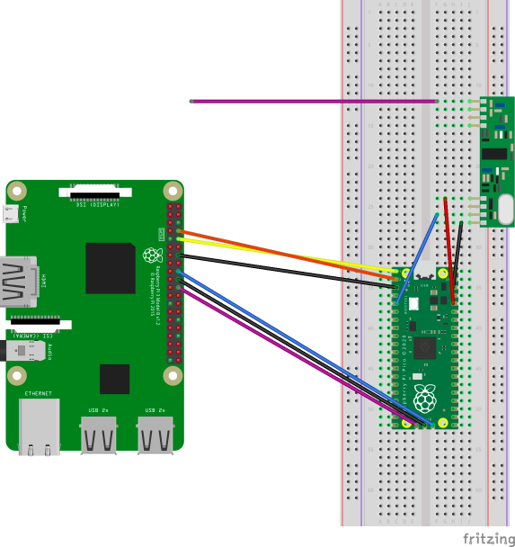

OregonPico
=========
433 Sensor Oregon Scientific decoder for Raspberry Pico

To compile this project, you will first need to follow Chapter 2 of the official Pico [guide](https://datasheets.raspberrypi.org/pico/getting-started-with-pico.pdf)

Layout should be as follows:
```
~/pico/pico-sdk/
~/pico/OregonPico/
```

Create a new build dir inside this repo:
```
mkdir ~/pico/OregonPico/build
```

Change into the directory and run the following:

```
export PICO_SDK_PATH=../../pico-sdk
cmake ..
make
```

This will create the `test.elf` file below.

To deploy this using SWD and monitor using minicom, run the following once you have wired everything up as below.

Start following in a terminal:
```
openocd -f interface/raspberrypi-swd.cfg -f target/rp2040.cfg
```

Also start minicom to listen for output in a new terminal:
```
minicom -b 115200 -o -D /dev/serial0
```

Enter gdb and load file:
```
gdb-multiarch test.elf
target remote localhost:3333
load
monitor reset init
continue
```

In the minicom terminal window you should see something similar to the following output:
```
OSV3 FA281493800690C956B5
Temp : 12.800000
Humidity : 98.000000
Channel : 1
OSV3 FA281493800690C956B5
Temp : 12.800000
Humidity : 98.000000
Channel : 1
```

Wiring layout:





Original readme follows for the OregonPi project.


OregonPi
========

433 Sensor Oregon Scientific decoder for Raspberry Pi

Code based on disk91 project http://www.disk91.com

Support OregonSensorV2
----------------------

 - THGR122NX
 - THN132N
 - THGRN228NX
 - WGR9180
 - STR928N
 - BTHG968

Hardware Config
---------------

https://projects.drogon.net/raspberry-pi/wiringpi/pins/

INPUT GPIO 1

Install wiringPi
----------------

 - sudo apt-get install git-core
 - sudo apt-get update
 - sudo apt-get upgrade
 - git clone git://git.drogon.net/wiringPi
 - cd wiringPi
 - git pull origin
 - ./build

Install OregonPi
----------------

 - cd ..
 - git clone git://github.com/1000io/OregonPi
 - cd OregonPi
 - make

Execute
-------

sudo ./test

Execute & Save Log Archive
--------------------------

nohup sudo /home/pi/OregonPi/test /home/pi/OregonPi/log_oregon.csv &

Log Example
-----------

[chanel number],[temp],[hum]

1,temp19.100000,hum69.000000

Pimatic Integration
-------------------

You can use it with pimatic-log-reader as I do :)

https://pimatic.org/plugins/pimatic-log-reader/

pimatic config example:

    {
      "id": "oregon1",
      "name": "Bedroom Sensor",    //sensor display name
      "class": "LogWatcher",
      "file": "/home/pi/OregonPi/log_oregon.csv",  //log file
      "attributes": [
        {
          "name": "temp",
          "type": "number",
          "unit": "°C"
        },
        {
          "name": "hum",
          "type": "number",
          "unit": "%"
        }
      ],
      "lines": [
        {
          "match": "1,temp(.+),hum(.+)",   // ->1<- Sensor channel number
          "temp": "$1",
          "hum": "$2"
        }
      ]
    }

Data Support
------------

Sensor(char * _strval); // construct and decode value

 - bool availableTemp(); // return true if valid && have Temp
 - bool availableHumidity(); // return true if valid && have Humidity
 - bool isBatteryLow(); // return true if valid && haveBattery && flag set.
 - bool hasChannel(); // return true if valid && haveChannel
 - bool isDecoded(); // return true if valide
 - bool availableSpeed(); // return true if valid && speed in km/h
 - bool availableDirection(); // return true if valid && wind direction
 - bool availableRain(); // return true if valid && rain in mm/h
 - bool availablePressure(); // return true if valid && pressure in mb
 - double getTemperature(); // return temperature in C°
 - double getHumidity(); // return humidity in % (base 100)
 - char * getSensorName(); // return sensor name
 - double getRain(); // return Rain
 - double getTrain();
 - double getDirection(); // return wind direction
 - double getSpeed(); // return speed in km/h
 - double getPressure(); // return pressure in mb
 - int getChannel(); // return channel value
 - int getSensClass(); // return sensor class
 - int getSensType(); // return sensor type

Thanks to
---------

@renzo38 & @FunFR


